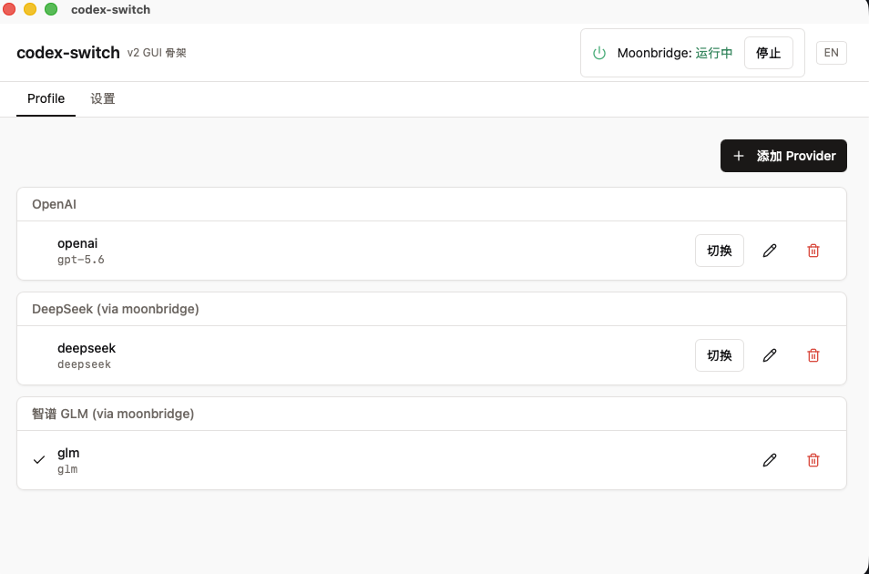

# codex-switch

桌面 GUI，给 [codex CLI](https://github.com/openai/codex) 用户切换 OpenAI / DeepSeek / GLM 等 profile，自动处理 moonbridge 代理 + API key + model catalog。

[English](./README.md#english) | [中文](#中文)

---

## 中文

### 截图

### 解决什么问题

codex CLI 0.130 砍掉了 `wire_api = "chat"`，只支持 OpenAI 的 `/v1/responses` 协议。要让 codex 连 DeepSeek / 智谱 GLM / 任何不暴露 Responses API 的国内云，必须走协议翻译代理（[moonbridge](https://github.com/ZhiYi-R/moon-bridge)）。手工编 TOML / YAML 麻烦，key 又得管，这个 app 一站式干掉。

### 功能 (v0.2.0-alpha.1)

- **通用 Add Provider** — 选模板（DeepSeek / 智谱 GLM）→ 输 API key → 自动 probe 真实 model 列表 → 多选启用哪些 → 一键写盘
- **Multi-provider 共存** — DeepSeek + GLM 同时装，codex 通过 `--profile <name>` 切，tray 菜单和主窗口都能切
- **Re-probe** — provider 升级新 model 时，Edit 里点重新探测，自动 merge 进现有 enabled 状态
- **Moonbridge daemon 管理** — 顶栏徽章看 listener 状态，start/stop 不离 app
- **明文 toggle** — API key 输入框眼睛图标，临时显示明文核对
- **中英双语 UI** — 跟系统语言或手动切
- **未签名 dmg** — 首次开需手动绕过 Gatekeeper（见下面安装说明）

### 平台支持

- ✅ **macOS 11+ (Apple Silicon arm64 only)** — 已发布
- ⏳ macOS Intel (x86_64) — coming later
- ⏳ Windows / Linux — coming later (Windows 需补 stop/lsof 替代，Linux 缺 CI)

### 安装

1. 在 [Releases](https://github.com/qinqiangdavid/codex-switch/releases) 下载最新 `.dmg`
2. 双击挂载，把 `codex-switch.app` 拖到 Applications
3. **绕过 Gatekeeper**（未签名）：
   - 右键 `.app` → 打开 → "仍要打开"
   - 或终端跑 `xattr -cr /Applications/codex-switch.app`
4. 首次开会看到 "Setup incomplete" 提示，照 Settings tab 装：
   - [codex CLI](https://github.com/openai/codex) (`npm install -g @openai/codex` 或 brew)
   - [moonbridge](https://github.com/ZhiYi-R/moon-bridge) (`go install github.com/ZhiYi-R/moon-bridge/...@latest`)

### Quick Start

1. 打开 codex-switch，主窗口 Profiles tab 点 `[+ Add Provider]`
2. 选 **DeepSeek**（或 GLM），输入 API key
3. 点 **[Probe & Add]**，看到上游真实 model 列表 → 勾选要启用的 → 选 default model → Finish
4. 顶栏看 Moonbridge 徽章绿色 = listener 已起
5. 终端跑 `codex --profile deepseek` 或 `codex --profile glm` 开始用

### 已知限制 (alpha)

- arm64 only，Intel Mac 装不了
- 未签名，每次升级新 dmg 需重新允许 Gatekeeper
- moonbridge daemon 需用户单独装（自动下载 binary 还没做）
- API key 现在以明文存 `~/.codex-switch/providers.json` (权限 0600)。OS Keychain 在 alpha 阶段因为未签名 app 拒访已绕过

### License

MIT。详见 [LICENSE](./LICENSE)。

---

## English

Desktop GUI for [codex CLI](https://github.com/openai/codex) users to switch profiles between OpenAI / DeepSeek / GLM and other providers, with automatic moonbridge proxy + API key + model catalog management.

### Why

codex CLI 0.130 removed `wire_api = "chat"` support, so connecting codex to DeepSeek / GLM / any provider that doesn't expose OpenAI's `/v1/responses` requires a protocol bridge ([moonbridge](https://github.com/ZhiYi-R/moon-bridge)). Manually editing TOML / YAML and managing API keys is painful — this app takes care of it.

### Features (v0.2.0-alpha.1)

- **Generic Add Provider** — pick template (DeepSeek / GLM) → enter API key → auto-probe real model list → multi-select which to enable → one-click write
- **Multi-provider coexistence** — DeepSeek + GLM at the same time, switch via `codex --profile <name>` or tray menu
- **Re-probe** — when provider releases new models, click Re-probe in Edit dialog to merge into existing enabled state
- **Moonbridge daemon control** — listener up/down badge in header, start/stop without leaving the app
- **Show / hide API key toggle** — eye icon in inputs to verify pasted keys
- **Bilingual UI** — English / Simplified Chinese, follows OS locale

### Platform Support

- ✅ **macOS 11+ (Apple Silicon arm64 only)** — released
- ⏳ macOS Intel (x86_64) — coming later
- ⏳ Windows / Linux — coming later

### Installation

1. Download latest `.dmg` from [Releases](https://github.com/qinqiangdavid/codex-switch/releases)
2. Mount and drag `codex-switch.app` into Applications
3. **Bypass Gatekeeper** (unsigned):
   - Right-click `.app` → Open → "Open anyway"
   - Or `xattr -cr /Applications/codex-switch.app` in terminal
4. On first launch, install dependencies as instructed in the Settings tab:
   - [codex CLI](https://github.com/openai/codex)
   - [moonbridge](https://github.com/ZhiYi-R/moon-bridge)

### Quick Start

1. Open codex-switch, click `[+ Add Provider]` in Profiles tab
2. Pick **DeepSeek** or **GLM**, paste API key
3. Click **[Probe & Add]**, select which models to enable → pick default → Finish
4. Verify Moonbridge badge in header is green
5. Run `codex --profile deepseek` or `codex --profile glm`

### Known limitations (alpha)

- arm64 only, Intel Mac not yet supported
- Unsigned, every dmg upgrade requires re-allowing Gatekeeper
- moonbridge daemon installation is manual (auto-download not yet implemented)
- API keys stored as plaintext in `~/.codex-switch/providers.json` (mode 0600). OS Keychain bypassed in alpha due to unsigned-app access issues.

### License

MIT, see [LICENSE](./LICENSE).
